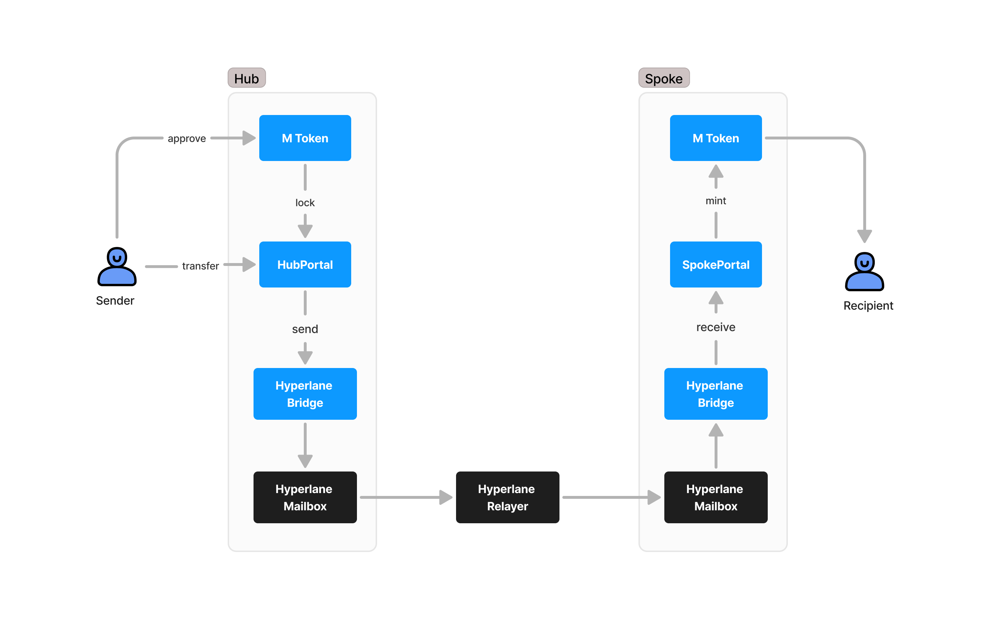
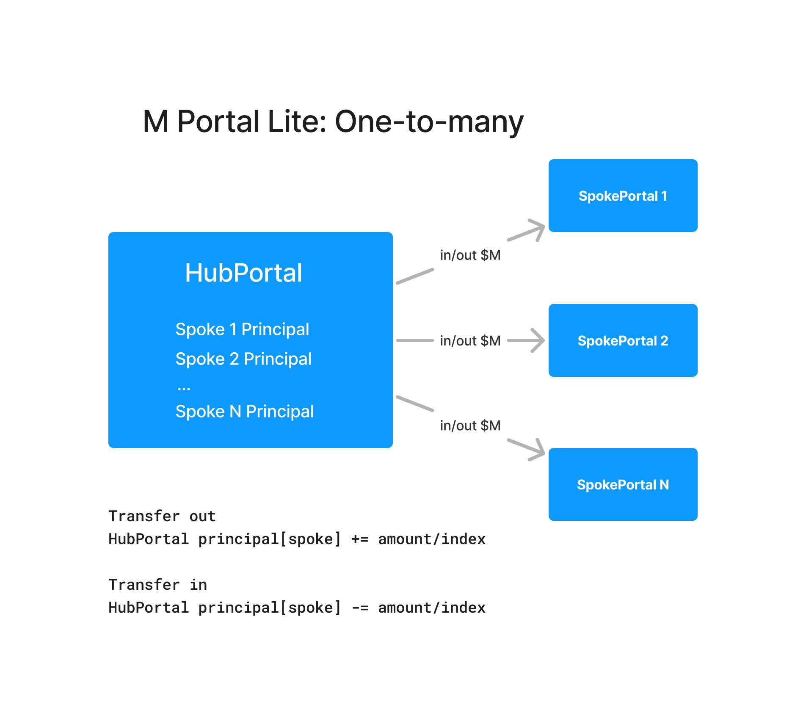

## M Portal Lite

The aim of M0 cross-chain strategy is to make $M token natively multichain, offering users the same yield-earning capabilities on different chains while maintaining $M issuance and governance on Ethereum.

**M Portals** are the main components of M0 multi-chain model responsible for bridging tokens and propagating system information.
**M Portal Lite** is a simplified version of [M Portal](https://github.com/m0-foundation/m-portal) implementation, designed to support only EVM chains and following _one-to-many_ model, where Spokes can communicate with the Hub but not with each other.

## Architecture

Since both governance and issuance of new $M tokens are done exclusively on Ethereum, the M0 multichain model employs different implementations of the Portal contract on different chains. On Ethereum, `HubPortal` uses a _lock-and-release_ mechanism for token transfers and enables the propagation of $M earning index and TTG registrar values to other chains. Conversely, `SpokePortal`, deployed on all other chains, follows a _mint-and-burn_ model for bridging tokens and is responsible for updating $M earning index and TTG registrar values based on messages received from `HubPortal`.

Both HubPortal and SpokePortal use `Bridge` contract that utilizes Hyperlane protocol for cross-chain communication.

### M Token Transfer

When a user transfers tokens from the Hub chain to a Spoke chain, the tokens are locked in the `HubPortal`, and a cross-chain message is sent to the Spoke chain via `HyperlaneBridge`. Upon receiving the message, an equivalent number of tokens is minted on the Spoke chain and transferred to the user. Similarly, when transferring M tokens from a Spoke chain back to the Hub, the tokens are burned on the Spoke chain, and an equivalent number of tokens is released on the Hub chain. Bridging $M tokens between Spoke chains are not allowed.



To prevent unlocking more tokens on the Hub that were locked, `HubPortal` stores outstanding principal amounts of bridged out $M tokens for each supported chains, which is updated when transfer is sent and received.



### Earning Index Propagation

$M is a yield-bearing token with built-in earning functionality for a selected set of earners approved by TTG. The maximum earner rate is determined through TTG governance, while an additional safe earner rate is automatically derived based on the total active owed $M and the total earning supply.

This safe rate is calculated in [EarnerRateModel](https://etherscan.io/address/0x6b198067E22d3A4e5aB8CeCda41a6Da56DBf5F59#code) contract on Ethereum. The $M index represents the accrual of this rate to all earners in the system. Propagating the earner rate is essential for accurate yield distribution across the M^0 Protocol on Ethereum and other chains.

There are two ways to update the $M earning index on a Spoke chain:

- Perform a cross-chain transfer from the Hub chain.
- Explicitly call `sendMTokenIndex` function in `HubPortal`.

### TTG Registrar Values Propagation

M0 system parameters approved by the governance are stored in `Registrar` contract on Ethereum. `HubPortal` propagates those parameters to Spoke chains.

## Development

Install dependencies:

```bash
forge install
```

Compile the contracts:

```bash
forge build
```

